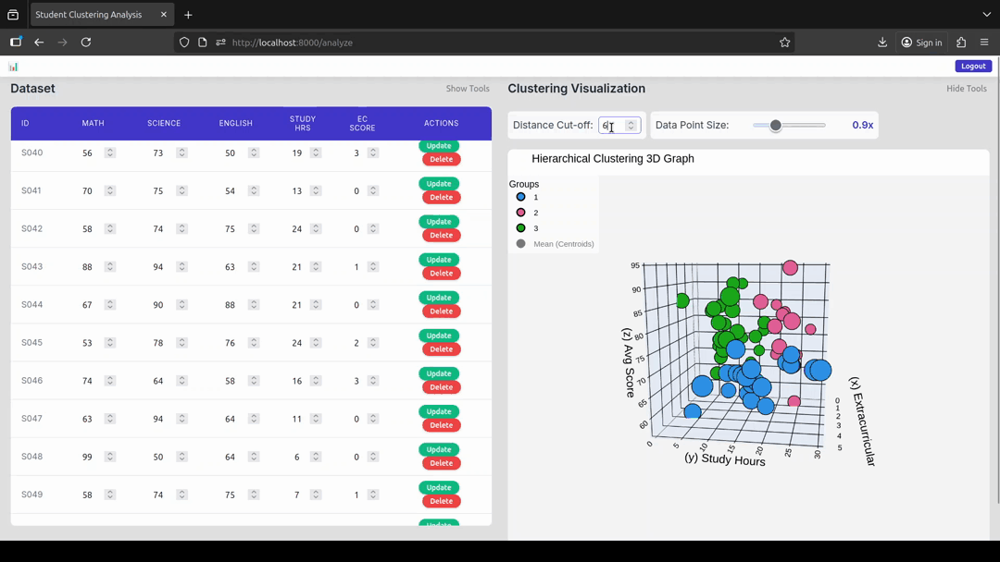
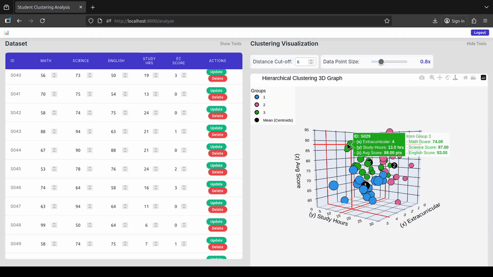

# 3D Hierarchical Clustering Visualizer Prototype

## Overview
This project is a GUI-based tool for visualizing hierarchical clustering in **three dimensions**. It allows users to explore student datasets (grades, study hours, extracurricular activity levels) without writing any code. Users can manipulate clustering parameters and generate interactive 3D scatter plots to better understand the hidden relationships within the data.

---

## Problem Statement
Traditional clustering visualizations are mostly 2D and require programming knowledge. This makes it difficult for beginners, researchers, or students to:
- Understand multi-dimensional clustering relationships
- Adjust clustering parameters dynamically
- Explore hidden subgroups in datasets without coding

This prototype solves these problems by providing a **user-friendly interface** that allows dynamic interaction with clustering visualizations.

---

## Objectives
- Provide a **no-code interface** for hierarchical clustering visualization  
- Enable **3D exploration** of datasets across three features simultaneously  
- Allow users to **manipulate clustering parameters** such as distance cutoff and data point size  
- Demonstrate the **feasibility and usability** of a GUI for unsupervised machine learning

---

## Features

### 1. CRUD Operations
- Load, add, edit, or delete student dataset entries from CSV files

---

### 2. 3D Feature Selection
- Select X, Y, and Z axes from available dataset features
- Explore multi-dimensional clustering interactively

---

### 3. Adjustable Distance Cutoff
- Dynamically control the hierarchical clustering distance cutoff
- Higher cutoff → fewer clusters
- Lower cutoff → more fine-grained clusters

---

### 4. Adjustable Data Point Size
- Change the size of data points for better visibility across devices

---

### 5. Interactive 3D Visualization
- Rotate, zoom, and pan the 3D cluster plot  
- Hover over points to view additional information  

---

## Conceptual Framework
This prototype is grounded in the following theoretical frameworks:

1. **Human-Computer Interaction (HCI)**  
   - Direct manipulation interface for parameter sliders and 3D interaction  
   - Designed following usability heuristics

2. **Hierarchical Clustering Theory**  
   - Agglomerative clustering with adjustable distance cutoff  
   - Reveals hidden subgroups in the dataset

3. **Visual Analytics Framework**  
   - Integrates data, machine learning, and interactive visualization  
   - Enables exploratory data analysis

4. **Prototyping Fidelity**  
   - High-fidelity interactive prototype demonstrating core functionality

---

## System Architecture
**Frontend (GUI)**
- Built with [Your GUI library, e.g., Tkinter, PyQt, CustomTkinter]  
- Handles user inputs and parameter adjustments

**Backend**
- Data loading and preprocessing (CSV files)  
- Hierarchical clustering engine (SciPy linkage + fcluster)  
- 3D plotting (Plotly)

**Data Flow**
