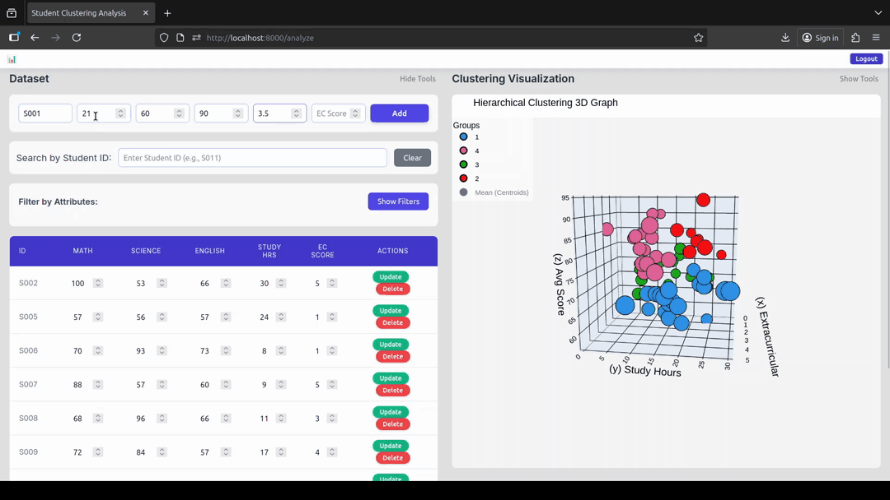
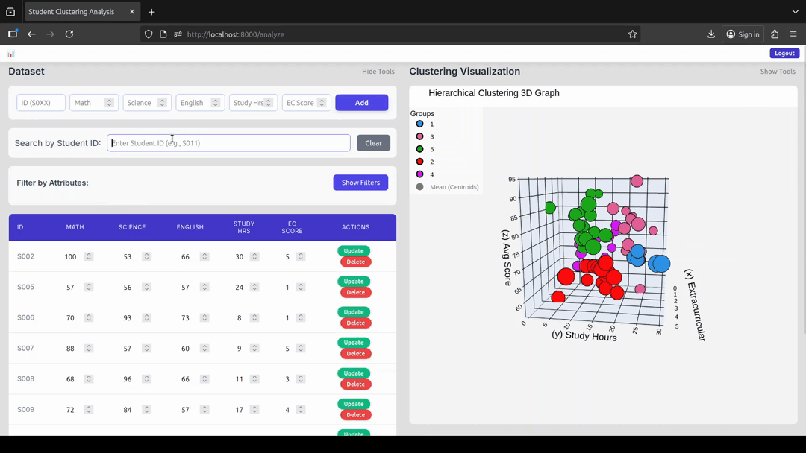
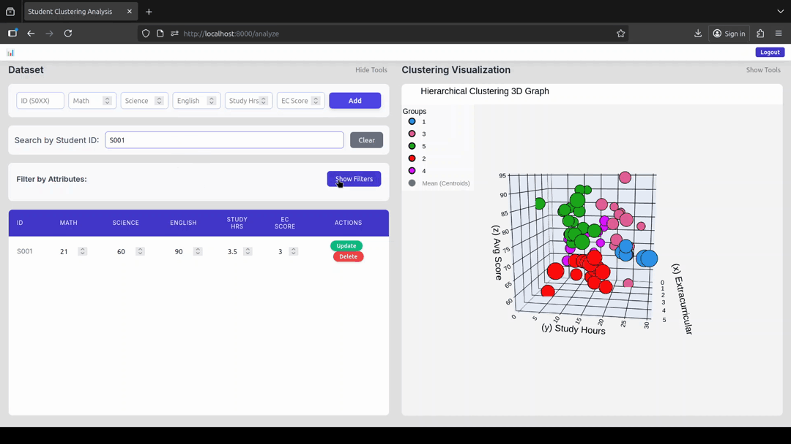
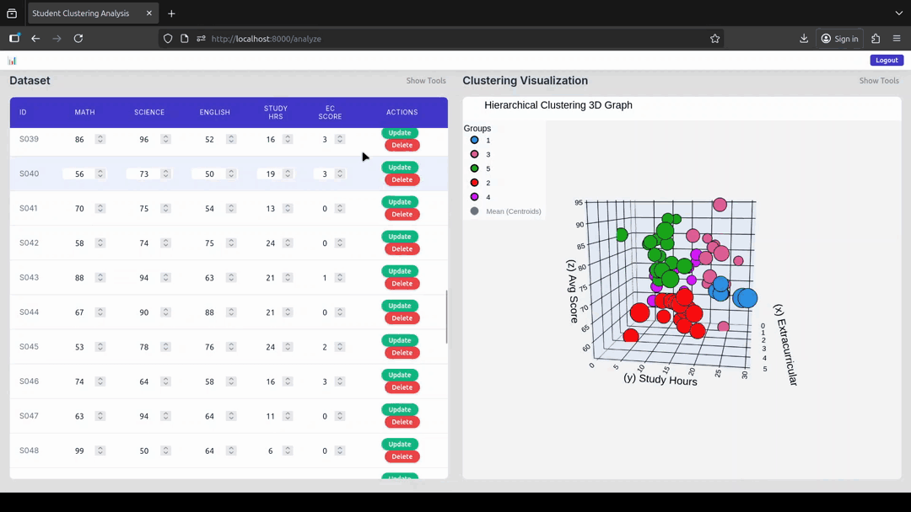
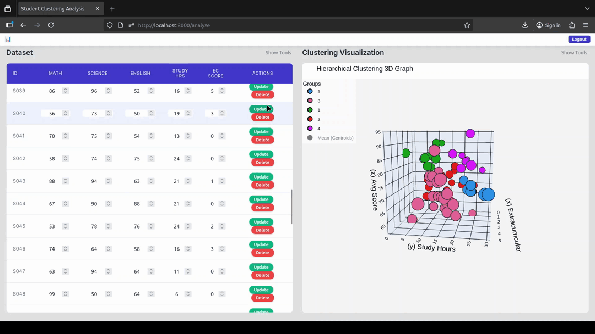

# 3D Hierarchical Clustering Visualizer Prototype

## Overview
This project is a GUI-based tool for visualizing hierarchical clustering in **three dimensions**. It allows users to explore student datasets (grades, study hours, extracurricular activity levels) without writing any code. Users can manipulate clustering parameters and generate interactive 3D scatter plots to better understand the hidden relationships within the data.

---

## Problem Statement
Traditional clustering visualizations are mostly 2D and require programming knowledge. This makes it difficult for beginners, researchers, or students to:
- Understand multi-dimensional clustering relationships
- Adjust clustering parameters dynamically
- Explore hidden subgroups in datasets without coding

This prototype solves these problems by providing a **user-friendly interface** that allows dynamic interaction with clustering visualizations.

---

## Objectives
- Provide a **no-code interface** for hierarchical clustering visualization  
- Enable **3D exploration** of datasets across three features simultaneously  
- Allow users to **manipulate clustering parameters** such as distance cutoff and data point size  
- Demonstrate the **feasibility and usability** of a GUI for unsupervised machine learning

---

## Features

### 1. CRUD Operations
- Load, add, edit, or delete student dataset entries from CSV files

#### **Create**

#### **Search by ID**

#### **Search by Filter**

#### **Update**

#### **Delete**

---

### 2. Adjustable Distance Cutoff
- Dynamically control the hierarchical clustering distance cutoff  
- Higher cutoff → fewer clusters  
- Lower cutoff → more fine-grained clusters

---

### 3. Adjustable Data Point Size
- Change the size of data points for better visibility across devices

---

### 4. Interactive 3D Visualization
- Rotate, zoom, and pan the 3D cluster plot  
- Hover over points to view additional information  

#### **Early Version**
- click on the link below if you want to interact with one of the early versions of the graph
   - ###### [Open 3D Graph (HTML)](demo/early_version_of_graph.html)

---

## Frameworks

1. **Human-Computer Interaction (HCI)**  
   - Direct manipulation interface for parameter sliders and 3D interaction  
   - Designed following usability heuristics

2. **Hierarchical Clustering Theory**  
   - Agglomerative clustering with adjustable distance cutoff  
   - Reveals hidden subgroups in the dataset

3. **Visual Analytics Framework**  
   - Integrates data, machine learning, and interactive visualization  
   - Enables exploratory data analysis

4. **Prototyping Fidelity**  
   - High-fidelity interactive prototype demonstrating core functionality

---

## Future Enhancements
- Add dendrogram visualization
- Add more parameter edits
- Implement PCA for higher-dimensional datasets  
- Add export options for graphs (PNG, CSV with cluster labels)  
- Include additional clustering algorithms (K-Means, DBSCAN)  
- Develop a web-based version for wider accessibility  
- Downloadable 3D graph as an HTML file  

---

## Limitations
- Only supports a specific set of dataset attributes  
- CSV dataset format only  
- Does not yet support extremely large datasets  
- No dendrogram overlay yet  

---
